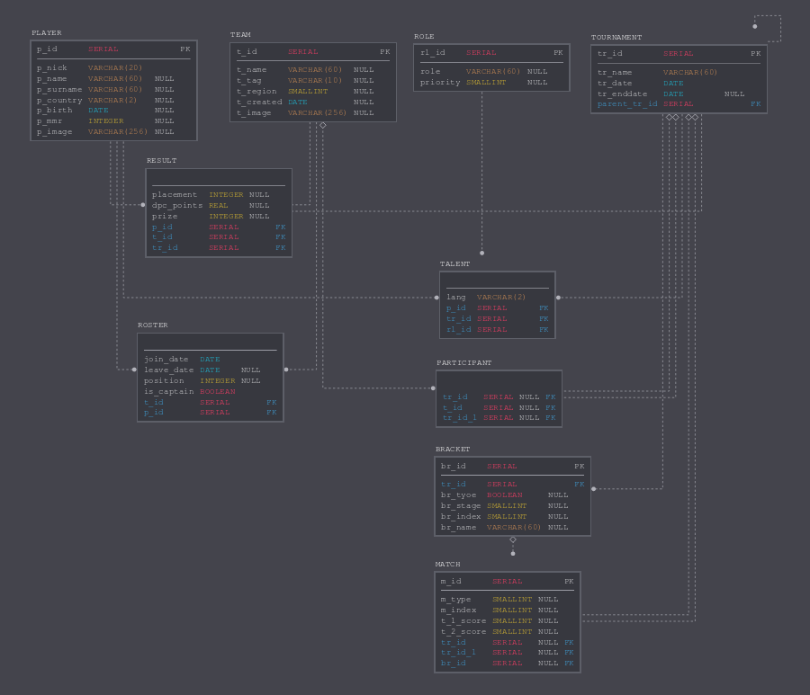
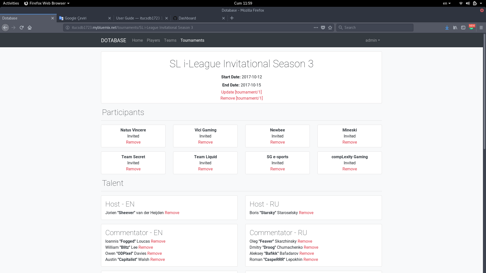

Developer Guide
===============

In the project PostgreSQL is the used database management system. Database has 10 tables.

Following three tables are the main tables in the project and other tables mostly reference these three tables;

* TEAMS
* PLAYERS
* TOURNAMENTS

Following tables store information about connections in three main tables;

* RESULT
* ROSTER
* PARTICIPANT
* TALENT

These two table are used to store information about matches in tournaments;

* BRACKET
* MATCHES

This table is basically a dictionary for talents' roles;

* ROLE

E/R Diagram
---------------

   	E/R diagram of the database

Code
----
.. highlight:: python

We used Flask to manage the routes of the website. All of the routes are defined in the main file (server.py).
For authentication we used Flask-Login extension. Routes in the website which have functions like adding/updating/removing content requires admin login.

**Initializing database**::

   @app.route('/initdb')
   def initialize_database():
       with dbapi2.connect(app.config['dsn']) as connection:
           cursor = connection.cursor()
           data1 = ""
           data2 = ""
           with open('structure.sql', 'r') as sql:
               data1=sql.read()
               cursor.execute(data1)
           with open('data.sql', 'r') as sql:
               data2=sql.read()
               cursor.execute(data2)
           connection.commit()
       return redirect(url_for('home_page'))

Initialization of the database is done by executing two .sql files.

:structure.sql: Creating tables
:data.sql: Inserting some data to the tables

structure.sql can be altered to change the structures of tables and backup files can be stored as data.sql to prevent loss of data.

**Logging to the admin panel**::

  admin_user = User(1,"admin","correcthorsebatterystaple")

  @app.route("/login", methods=["GET", "POST"])
  def login():
      if request.method == 'POST':
          username = request.form['username']
          password = request.form['password']
          if admin_user.name == username and admin_user.password == password:
              login_user(admin_user)
              return redirect(url_for('home_page'))
          else:
              return abort(401)
      else:
          return Response(
                 render_template('header.html', title="Admin Login") + \
                 render_template('loginform.html') + \
                 render_template('footer.html')
                 )

  @app.route("/logout")
  @login_required
  def logout():
      logout_user()
      return Response(render_template('error.html',title="Logged out",error="User logged out successfully!"))

Credentials for the admin are stored in the server.py file and can be changed from there. Admin pages can be opened by logging in to the system from /login route. This will add links for admin functions like add/remove to all pages in the website.

   	Logged in admin can see admin pages in the header and remove/update functions in pages.

**Listing elements of main tables**::

  @app.route('/player')
  def players_page():
      with dbapi2.connect(app.config['dsn']) as connection:
          cursor = connection.cursor()
          query = """ SELECT PLAYER.p_nick,dpc
                      FROM (
                             SELECT SUM(dpc_points) as dpc,p_id
                             FROM RESULT
                             GROUP BY p_id
                             ORDER BY dpc DESC) as RESULT
                      RIGHT JOIN PLAYER
                      ON RESULT.p_id = PLAYER.p_id
                      ORDER BY dpc IS NULL, dpc DESC"""
          cursor.execute(query)
          players = cursor.fetchall()
          connection.commit()
      return render_template('header.html', title="Dotabase", route="player") + \
             render_template('list.html', title="All Players", route="player", items=players, badge="DPC Points") + \
             render_template('footer.html')

List pages for the main tables (players,teams,tournaments) are very similar and use 'list.html' template. Template uses two attribute for each entity to list them in the page.

**Admin forms**::

  @app.route("/add_team", methods=["GET", "POST"])
  @login_required
  def add_team():
      if request.method == 'POST':
          team_name = (request.form['team_name'],"t_name")
          team_tag = (request.form['team_tag'],"t_tag")
          region = (request.form['region'],"t_region")
          date_created = (request.form['date_created'],"t_created")
          image = (request.form['image'],"t_image")
          s = ""
          v = ""
          for var in (team_name,team_tag,region,date_created,image):
              if(var[0] != ""):
                  if(s==""):
                      s = var[1]
                      v = "'"+var[0]+"'"
                  else:
                      s += "," + var[1]
                      v += ","+"'"+var[0]+"'"
          query = """INSERT INTO TEAM ({})
          VALUES ({})""".format(s,v)

          with dbapi2.connect(app.config['dsn']) as connection:
              cursor = connection.cursor()
              try:
                  cursor.execute(query)
              except dbapi2.Error as e:
                  lcolor = "danger"
                  ltext = e.pgerror
                  pass
              else:
                  lcolor = "success"
                  ltext = "{} added to the dotabase".format(team_name[0])
                  pass
          return Response(
                 render_template('header.html', title="Add Team") + \
                 render_template('alert.html', color=lcolor, text=ltext) + \
                 render_template('teamform.html', regions=teamRegionList) + \
                 render_template('footer.html')
                 )
      else:
          return Response(
                 render_template('header.html', title="Add Team") + \
                 render_template('teamform.html', regions=teamRegionList) + \
                 render_template('footer.html')
                 )

This is an example for an add page which is only accesible to the admin. //////////////////////////////////////////////////////////////////////////////////////////////////////////

**Remove page**::

  @app.route('/remove_team/<id>')
  @login_required
  def remove_team(id):
      query = "DELETE FROM TEAM WHERE t_id='{}'".format(id)
      with dbapi2.connect(app.config['dsn']) as connection:
          cursor = connection.cursor()
          try:
              cursor.execute(query)
          except dbapi2.Error as e:
              text = e.pgerror
              pass
          else:
              text = "Team is successfully removed."
              pass
      return Response(
          render_template('error.html',title="Remove Team" ,error=text)
          )

This page is an example for a remove page which is only accesible to the admin. In this example page gets team id from the route and deletes the row for it from the table.

**JSON Search routes**::

  @app.route('/json/player/<nick>')
  def jsonplayer(nick):
      with dbapi2.connect(app.config['dsn']) as connection:
          cursor = connection.cursor()
          query = """ SELECT p_id,p_nick FROM PLAYER WHERE LOWER(p_nick) LIKE LOWER(%s)"""
          cursor.execute(query,['%'+nick+'%'])
          result = cursor.fetchall()
          connection.commit()
      resultList = []
      for i in result:
          resultList.append({"id":i[0],"name":i[1]})
      return jsonify(resultList)

This route searches the player table using an argument provided in the route. Arguments characters are lowered to prevent case-sensitive search. Results are used to generate list of dictionaries and the list. Route returns this list in JSON format.

.. highlight:: js

**Auto complete with AJAX**::

  $( function() {
    $("#inputPlayerName").autocomplete({
      source: function(request,response){
        $.getJSON("../json/player/"+request.term, function (data) {
          console.log(data);
          response($.map(data, function (value) {
                return {
                    value: value["id"],
                    label: value["name"]
                };
            }));
          });
      },
      dataType: "json",
      select: function(event,ui){
        event.preventDefault();
        $(this).val(ui.item.label);
        $("#inputPlayerId").val(ui.item.value);
      }
    });
  } );

With this jQuery code the string in the input field #inputPlayerName is searched in the database and used to fill #inputPlayerId.
Such AJAX queries use JSON search routes to search database.

****

.. toctree::

   member1
   member2
   member3
