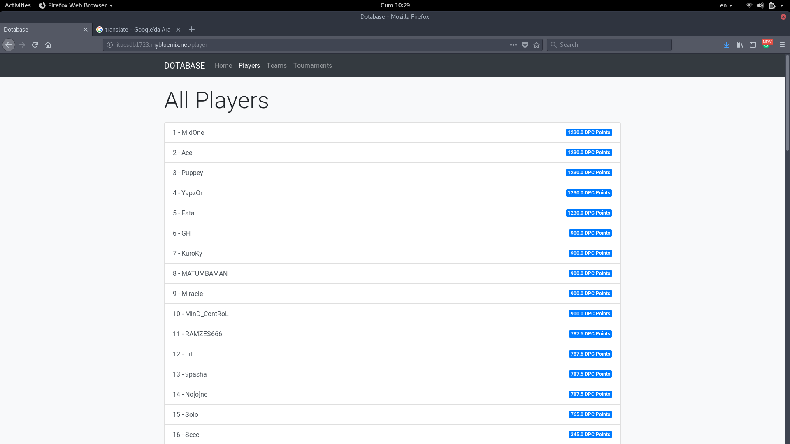
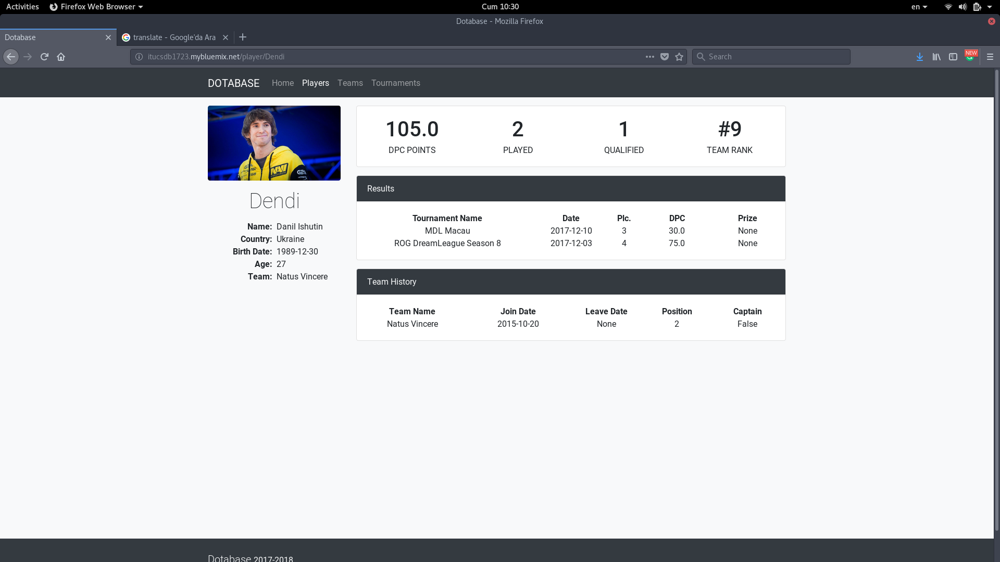
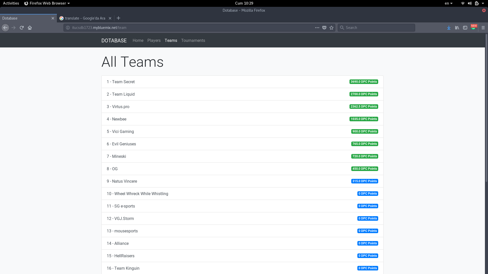
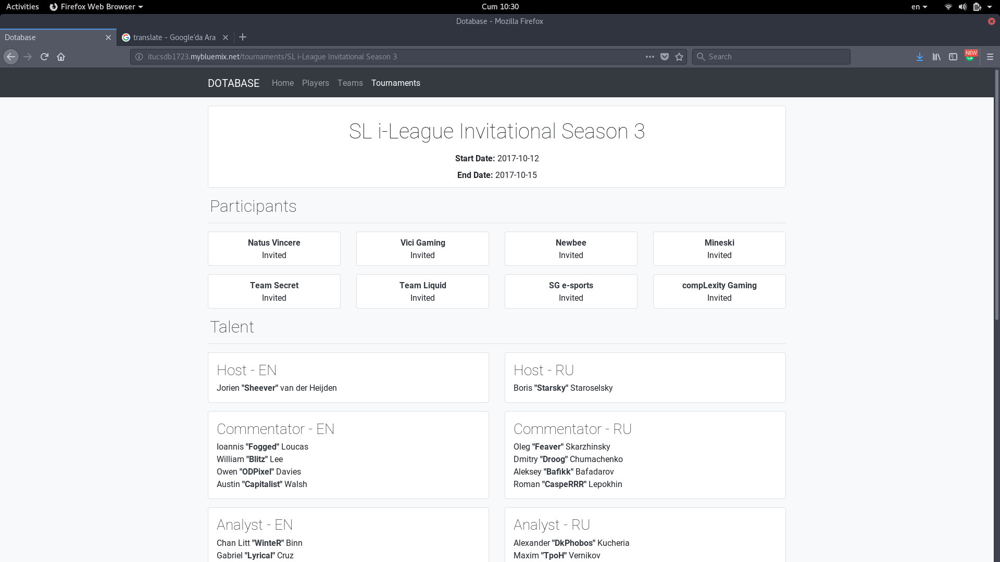

User Guide
==========

In this project we have used bootstrap and jQuery for frontend side of the website.

Our website consists of 4 major pages;

* Homepage
* Players Page
* Teams Page
* Tournaments Page

Homepage
--------

.. figure:: images/Homepage.png
	:scale: 50 %
	:alt:	A screenshot of the homepage
	:align: center

	*A screenshot from the homepage of our project*

In homepage there are two tables. First of these tables is Top 8 Teams table which lists the top 8 teams with highest DPC point. The other table is Upcoming Tournaments table which consists of upcoming tournaments and their starting date.

Players Page
------------

	*A screenshot from the players page of our project*

In players page user can view the list of the players that played dota professionally in history of DoTA. The list is ordered by the DPC points of the players. Each element directs the user to respective players player page.

Player Page
------------

	*A screenshot of the player page of Dendi*

In player pages user can see general information like name, birth date, age and team of the player. Beyond these information users can see the DPC point of the player, the number of times he or she played, the number of times he or she qualified and their team rank.

There are also two lists on each page results and team history. The first list is the results. In results list user can observe which tournaments this player joined, the dates of these tournaments, their placement in the tournament, the dpc points this player got through the tournament and their prize if they got a prize from the tournament. The second list is team history list which consists of the teams this player played in, the join and leave date (if left) of the player and his or her position in the game. 

Teams Page
----------

	*A screenshot from the teams page of our project*

In teams page user can view the list of the teams that existed in e-sports scene of DoTA. The list is ordered by the teams with highest DPC points which is calculated by adding up the DPC points of 3 players with highest DPC points in the respective team. Each element directs the user to respective teams team page.

Team Page
---------

.. figure:: images/Team.png
	:scale: 50 %
	:alt:	A screenshot of the player page
	:align: center

	*A screenshot of the team page of team Secret*

In team pages user can see general information about the team like team name, team tag, creation date and region of the team. The other information is in the lists in the right hand side. These lists are roster, result and matches lists. A more detailed explanation is given below for table in respective order.

There are also two lists on each page results and team history. The first list is the results. In results list user can observe which tournaments this player joined, the dates of these tournaments, their placement in the tournament, the dpc points this player got through the tournament and their prize if they got a prize from the tournament. The second list is team history list which consists of the teams this player played in, the join and leave date (if left) of the player and his or her position in the game. 

Tournaments Page
----------------

.. figure:: images/Tournamentspage.png
	:scale: 50 %
	:alt:	A screenshot of the tournaments page
	:align: center

	*A screenshot from the players page of our project*

In players page user can view the list of the players that played dota professionally in history of DoTA. The list is ordered by the DPC points of the players. Each element directs the user to respective players player page.

Tournament Page
---------------

	*A screenshot of the player page of Dendi*

In player pages user can see general information like name, birth date, age and team of the player. Beyond these information users can see the DPC point of the player, the number of times he or she played, the number of times he or she qualified and their team rank.

There are also two lists on each page results and team history. The first list is the results. In results list user can observe which tournaments this player joined, the dates of these tournaments, their placement in the tournament, the dpc points this player got through the tournament and their prize if they got a prize from the tournament. The second list is team history list which consists of the teams this player played in, the join and leave date (if left) of the player and his or her position in the game. 

.. toctree::

   member1
   member2
   member3

   